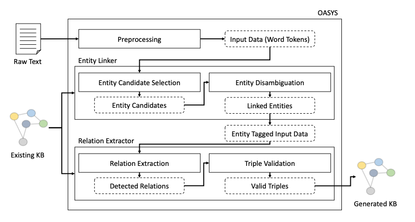

# OASYS
"OASYS: Domain-Agnostic Automated System for Constructing Knowledge Base from Unstructured Text" <br> 2022 SIGKDD workshop on Mining and Learning with Graphs, Accepted. <br>
## Citation
```
@InProceedings{
  title = 	 OASYS: Domain-Agnostic Automated System for Constructing Knowledge Base from Unstructured Text},
  author =       {Minsang Kim*, Sanghyun Je*, Eunjoo Park (*: equal contributions)},
  booktitle = 	 {SIGKDD 17TH INTERNATIONAL WORKSHOP ON MINING AND LEARNING WITH GRAPHS (SIGKDD-MLG)},
  year = 	 {2022},
  series = 	 {Proceedings of Machine Learning Research},
  month = 	 {15 August},
  publisher =    {ACM SIGKDD workshop on Mining and Learning with Graphs (SIGKDD-MLG)},
  pdf = 	 {https://arxiv.org/pdf/2207.07597.pdf},
  abstract = 	 {In recent years, creating and managing knowledge bases have become crucial to the retail product and enterprise domains. We present an automatic knowledge base construction system that mines data from documents. This system can generate training data during the training process without human intervention. Therefore, it is domain-agnostic trainable using only the target domain text corpus and a pre-defined knowledge base. This system is called OASYS and is the first system built with the Korean language in mind. In addition, we also have constructed a new human-annotated benchmark dataset of the Korean Wikipedia corpus paired with a Korean DBpedia to aid system evaluation. The system performance results on human-annotated benchmark test dataset are meaningful and show that the generated knowledge base from OASYS trained on only auto-generated data is useful. We provide both a human-annotated test dataset and an auto-generated dataset.}
  }
```
<p align="center">
  
</p>

## Dataset

### Our dataset is available at this [link](https://drive.google.com/drive/folders/1WFwL_h91FNgVi1x5ts6jrEPw3y4qbhPD?usp=sharing).

```bash
data
    ㄴ auto
          ㄴ train.json
          ㄴ valid.json
          ㄴ test.json
    ㄴ human
          ㄴ human_test.json
    ㄴ filtered_dbpedia_triples.json
```

## Dataset Statistics
### Auto-generated dataset
|dataset|train|valid|test|
|------|---|---|---|
|auto|366,872|45,961|45,962|
|human|0|0|6,058|

### the number of triples
291,215 triples

## Data Format
```bash
{
    sentence : {
        id : 61667 (integer) -> "unique sentence id",
        words : ["링컨", "네브래스카", "주", "링컨", "lincoln은", "미국", "네브래스카", "주", "동부", "에", "있는", "네브래스카", "주의", "주도", "이", "다"] (list) -> "tokenized words in sentence",
        posTags = ["NNP", "NNP", "NNG", "NNP", "NO", "NNP", "NNP", "NNG", "NNG", "JKB", "VA", "NNP", "NNG", "NNG", "VCP", "EC"] (list) -> "Part of Speech tags",
        depTags = ["compound", "compound", "compound", "compound", "nsubj", "compound", "compound", "compound", "obl", "obl", "acl", "compound", "nmod", "obl", "obl", "root"] (list) -> "Dependency tree tags",
        depHeads = [3, 3, 4, 5, 16, 8, 8, 9, 11, 11, 14, 13, 14, 16, 16, 0] (list) -> "Dependency tree head indexes of each tokens in words list",
    },
    triple : {
        src : {
            url : "http://ko.dbpedia.org/resource/링컨_(네브래스카_주)" (str) -> "dbpedia id of each entity",
            type : "http://dbpedia.org/ontology/Agent" (str) -> "dbpedia type id of each entity",
            str : "링컨" (str) -> "original entity name",
            tokenIndex : 0 (integer) -> "entity token start index in the words list"
        },
        relation : "<cruise:http://dbpedia.org/ontology/region>" (str) -> "relation between src and dst entity",
        dst : {
            url : "http://ko.dbpedia.org/resource/네브래스카_주" (str) -> "dbpedia id of each entity",
            type : "http://dbpedia.org/ontology/Place" (str) -> "dbpedia type id of each entity",
            str : "네브래스카주" (str) -> "original entity name",
            tokenIndex : 1 (integer) -> "entity token start index in the words list"
        }
    }
}
```

Contact: kgai@kakaoenterprise.com
